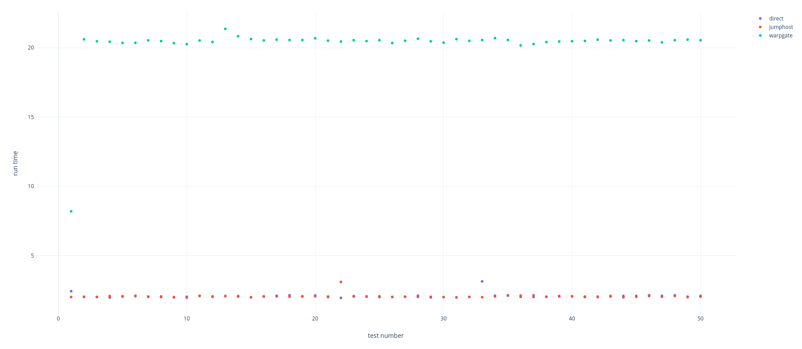

# warpgate-issue-459

## Setup

### Requirements
1. A [Hetzner Cloud](https://www.hetzner.com/cloud) account.
2. A ssh key

### Setup steps
1. Create 3 servers at Hetzner cloud in the "Nuremburg" region of type cpx11 with Ubuntu 20.04.
    1. Name them ansible, warpgate, target
2. Connect to the ansible server (via root@ip) and run the following commands:
```bash
apt update && apt upgrade -y
apt install -y python3 python3-pip git
pip3 install ansible
cd /root/
git clone https://github.com/ntimo/warpgate-issue-459.git warpgate-issue-459
```
1. Fill out the host_vars at `/root/warpgate-issue-459/ansible/host_vars/`
   1. Ip of the warpgate vm `/root/warpgate-issue-459/ansible/host_vars/target_warpgate/main.yml` by replacing "<warpgate_ip_here>" with it.
   2. Ip of the warpgate vm `/root/warpgate-issue-459/ansible/host_vars/target_jumphost/main.yml` by replacing "<warpgate_server_ip>" with it.
   3. Ip of the target vm `/root/warpgate-issue-459/ansible/host_vars/target_jumphost/main.yml` by replacing "<target_ip_here>" with it.
   4. Ip of the target vm `/root/warpgate-issue-459/ansible/host_vars/target_direct/main.yml` by replacing "<target_ip_here>" with it.
2. Generate a ssh key on the Ansible VM with no password using this command
```bash
 ssh-keygen -t ed25519
```
5. Copy your public ssh key for later
```bash
cat /root/.ssh/id_ed25519.pub
```
6. Connect to the warpgate server (via root@ip) and run the following commands:
```bash
apt update && apt upgrade -y
apt install -y wget unzip
wget -O /tmp/nightly.zip https://nightly.link/warp-tech/warpgate/workflows/build/main/warpgate-main-x86_64-linux.zip
cd /tmp/
unzip /tmp/nightly.zip
mv /tmp/warpgate /usr/bin/warpgate
chmod +x /usr/bin/warpgate

warpgate unattended-setup --admin-password "pBu6ZkWzCopVt6M8b2rQEKzEYr3GABeg" --http-port "8080"  --ssh-port "2233" --record-sessions --data-path "/var/lib/warpgate"

cat <<EOF > /etc/systemd/system/warpgate.service
[Unit]
Description=Warpgate
After=network.target
StartLimitIntervalSec=0

[Service]
Type=notify
Restart=always
RestartSec=5
ExecStart=/usr/bin/warpgate --config /etc/warpgate.yaml run

[Install]
WantedBy=multi-user.target
EOF

systemctl daemon-reload
systemctl enable --now warpgate
```
7. Open the warpgate web ui at https://<warpgate_server_ip>:8080 and login with user: `admin` and password: `pBu6ZkWzCopVt6M8b2rQEKzEYr3GABeg`
   1. Go to `Manage Warpgate`
   2. Then go to the `Config` menu
   3. Create a new target with name `target` and type ssh
   4. Enter the IP of your target server
   5. Make sure access for the `warpgate:admin` role is enabled
   6. On the `Config` page click on the `admin` user and add the public key from the Ansible server
   7. Change the Authentication policy to only allow key auth for ssh for the admin user
   8. Copy the ECDS key from the `SSH` page.
8. Connect to the target server via (root@) and add the ecda public key to the /root/.ssh/authorized_keys file
```bash
apt update && apt upgrade -y
apt install -y python3 python3-pip
echo "<ed25519_key>" >> /root/.ssh/authorized_keys
```
9. Run the following command on the ansible server and confirm the warpgate detected ssh finterprint once your are in the remove shell type `exit`:
```bash
ssh 'admin:target@<warpgate_server_ip>' -p 2233 -i /root/.ssh/id_ed25519 
```
10. Now on the ansible server run the playbook:
```bash
cd /root/warpgate-issue-459/ansible/
ansible-playbook playbook_direct.yml --diff
ansible-playbook playbook_jumphost.yml --diff
ansible-playbook playbook_warpgate.yml --diff
```
11. Run the playbook a few times in row you should see that the first connection is faster then the next ones. Here is one example:
    1.  You can also run the playbook automatically a few times by running the tests.sh inside of the ansible directory (this will run each test 50 times and write the times to a `times_*.log` file)
example result:
```bash
0:00:16.303 *****
0:00:19.805 *****
0:00:19.800 *****
```

## Results
The results for an automated run (50 times) for each connection method are located in the results directory.
results plot:

